# 🌌 Pipeline de Classificação Astronômica do SDSS

> **Nota Acadêmica:** Este projeto foi desenvolvido como parte de um trabalho prático para a disciplina de **Inteligência Computacional** no **CEFET-MG**.

Este repositório contém o pipeline de Machine Learning desenvolvido para a classificação automatizada de objetos celestes do Sloan Digital Sky Survey (SDSS). O objetivo principal é distinguir com alta precisão entre **Galáxias (GALAXY)**, **Estrelas (STAR)** e **Quasares (QSO)**, viabilizando a análise de dados em larga escala na astrometria moderna.

---

## 📋 1. O Problema e a Contextualização

O SDSS gera um volume massivo de dados de observação do céu profundo. A classificação manual desses corpos celestes é impraticável, exigindo abordagens automatizadas. O desafio técnico reside em lidar com:
* **Desbalanceamento de Classes:** Galáxias dominam o dataset, superando os Quasares em uma proporção de quase 3:1.
* **Sobreposição Fotométrica ("Photometric Crowding"):** Bandas de luz frequentemente apresentam densidades sobrepostas entre diferentes classes.
* **Ruídos e Artefatos:** Erros de leitura de sensores e anomalias instrumentais que não representam fenômenos físicos.

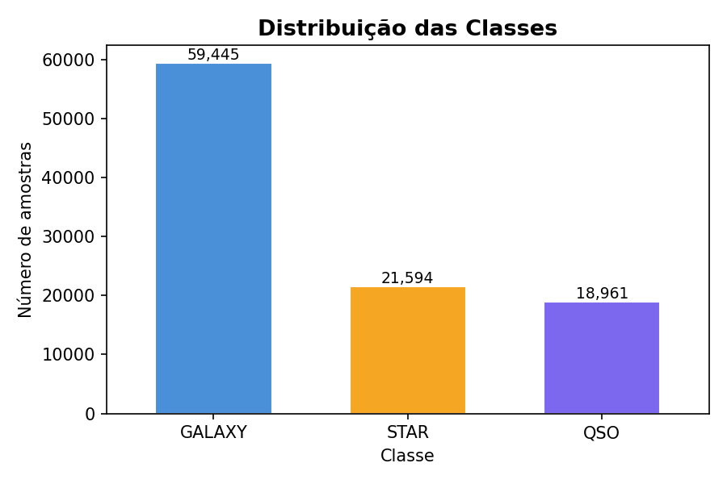

---

## ⚙️ 2. Pipeline de Dados e Pré-processamento

Para garantir que os modelos aprendam padrões físicos reais e não ruídos, implementamos um pipeline de pré-processamento robusto.

### Análise Exploratória (EDA) e Correlação
A análise de distribuição e dispersão revelou que características como o `redshift` possuem bimodalidade clara, sendo vitais para separar Quasares. Variáveis de indexação (`obj_ID`, `spec_obj_ID`) não possuem valor físico.

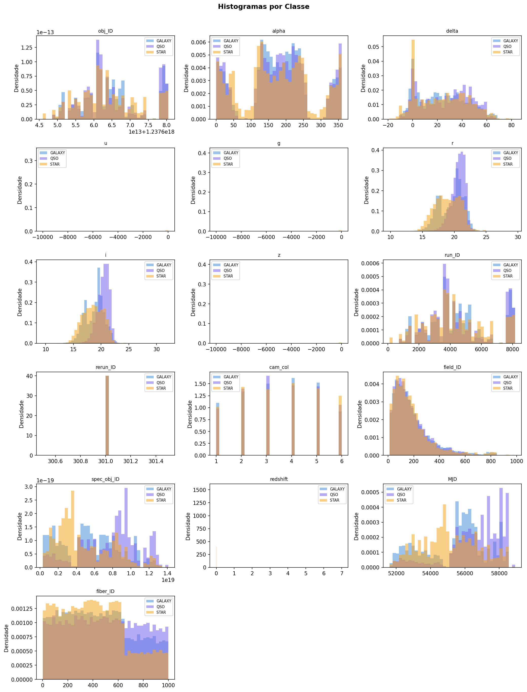
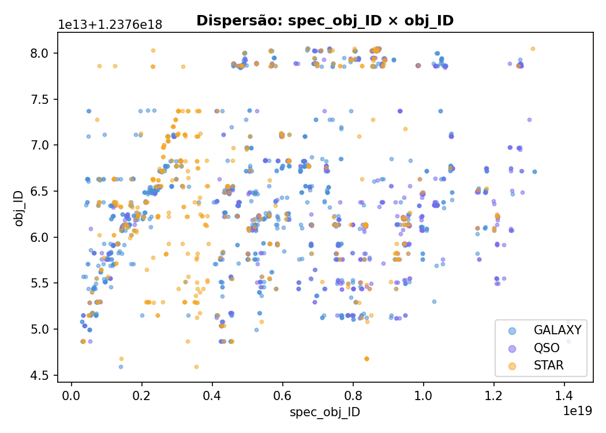

A Matriz de Correlação de Pearson evidenciou redundâncias críticas que precisavam ser tratadas para otimizar o treinamento:
* **Redundância Instrumental:** `obj_ID` e `run_ID` (correlação de 1.00).
* **Redundância Temporal:** `spec_obj_ID` e `MJD` (correlação de 0.97).
* **Multicolinearidade Fotométrica:** Bandas de luz como `u` e `g`.

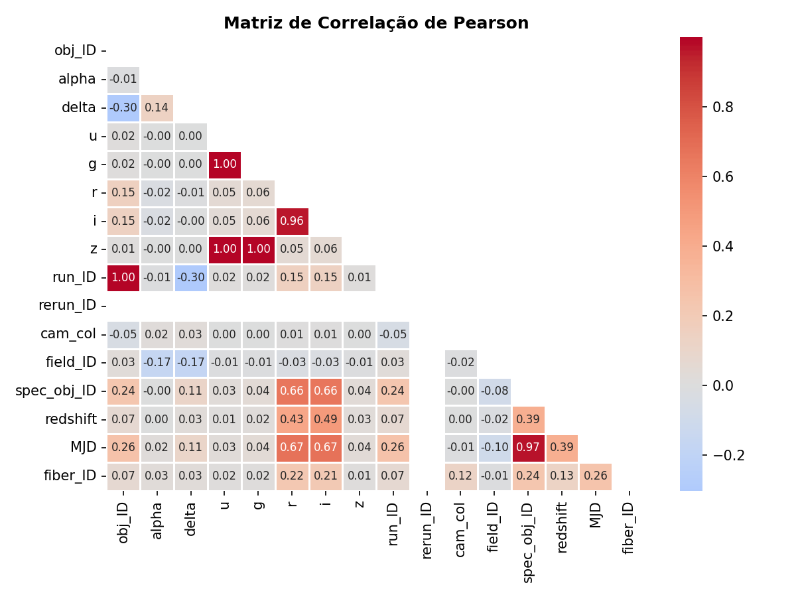

### Saneamento e Engenharia de Features
1. **Tratamento de Outliers:** Aplicamos a regra de $\mu \pm 3\sigma$ para remover artefatos instrumentais severos (valores anômalos próximos a -10.000), preservando a integridade das distribuições.
    * *Antes:* 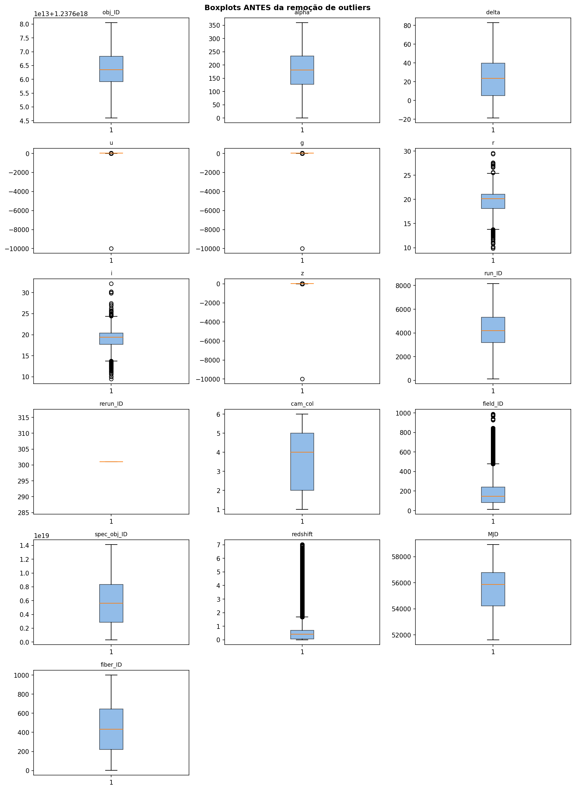
    * *Depois:* 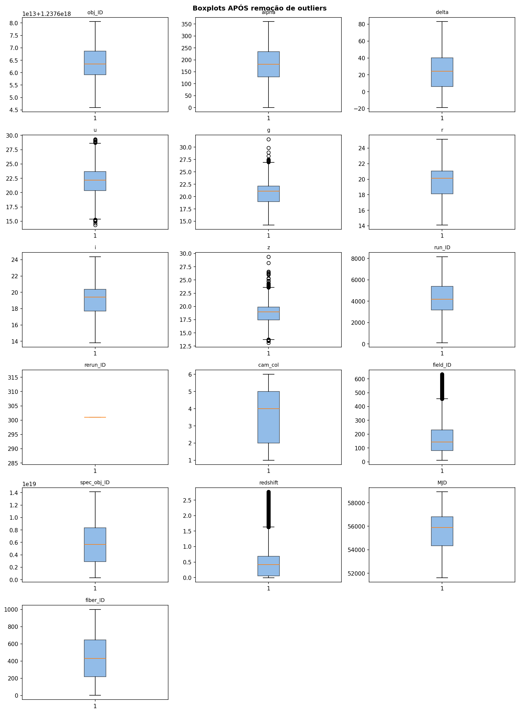
2. **Normalização (Z-score):** Fundamental para estabilizar o gradiente em redes neurais e evitar que features com grandes grandezas dominem o cálculo de distância no KNN.
3. **Seleção de Atributos:** Utilizando ANOVA F-Score, mantivemos as features de maior relevância física (como o `redshift`, com score > 100.000) e descartamos metadados irrelevantes.

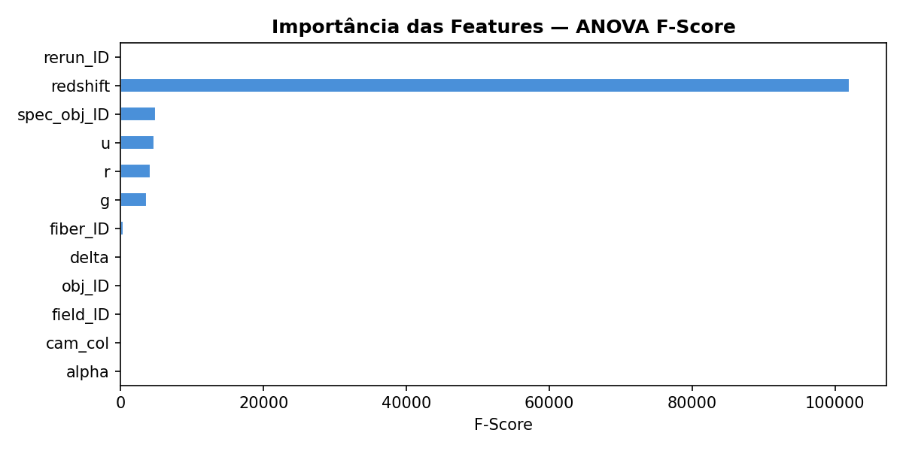

---

## 🧠 3. Modelagem e Algoritmos

Adotamos três paradigmas distintos de modelagem, validados através de **Stratified K-Fold Cross-Validation** (com normalização aplicada estritamente dentro de cada fold para evitar *data leakage*). Uma seed fixa (42) foi utilizada em todos os componentes estocásticos para garantir reprodutibilidade.

### K-Nearest Neighbors (KNN)
* **Configuração:** $k=7$ com pesos ponderados pela distância.
* **Por que foi escolhido:** Serve como um excelente baseline baseado em instâncias (distância espacial).
* **Limitação:** Sofre com a sobreposição de bandas fotométricas, o que afeta sua precisão ao separar estrelas de galáxias.

### Random Forest (Ensemble)
* **Configuração:** 150 estimadores, seed = 42.
* **Por que foi escolhido:** Lida nativamente com não-linearidades (como o `redshift`), é altamente resiliente a outliers remanescentes e minimiza o *overfitting* através de amostragem estocástica.

### Support Vector Machine (SVM) — Kernel RBF com One-vs-One
* **Configuração:** Kernel RBF, estratégia de decisão one-vs-one (OvO), $C=1.0$, $\gamma=\texttt{scale}$.
* **Por que foi escolhido:** Paradigma de margem máxima capaz de capturar fronteiras de decisão não-lineares entre as classes astronômicas, teoricamente eficaz para dados multi-dimensionais com sobreposição fotométrica.
* **Trade-off:** Alcança F1-Score competitivo (0.9552), porém com custo computacional significativamente mais alto (~35.7s por fold).

---

## 📊 4. Resultados e Avaliação de Desempenho

O **F1-Score (Macro)** foi eleito a métrica principal de avaliação devido ao desbalanceamento das classes, garantindo que o desempenho na classe minoritária (QSO) não fosse ofuscado. Os resultados abaixo refletem a média e desvio padrão de 50 avaliações (5 repetições × 10-fold com seed fixa = 42).

| Modelo | Acurácia Média | F1-Score (Macro) | Tempo Médio/fold |
| :--- | :--- | :--- | :--- |
| **Random Forest** | **0.9774 ± 0.0013** | **0.9723 ± 0.0016** | **7564.0 ms** |
| SVM (RBF, OvO) | 0.9624 ± 0.0015 | 0.9560 ± 0.0018 | 52637.2 ms |
| KNN | 0.9197 ± 0.0026 | 0.9077 ± 0.0031 | 146.0 ms |

### Matrizes de Confusão
O KNN confundiu 15% das estrelas com galáxias devido ao "photometric crowding". Em contrapartida, Random Forest e SVM atingiram desempenho excelente na classe STAR (≥99.9% recall) e segregação superior para Quasares.

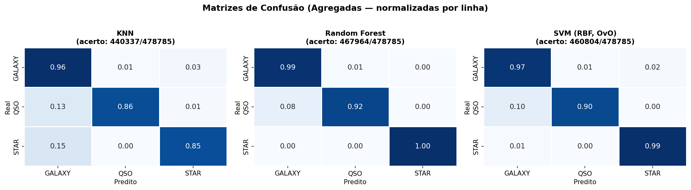

### Estabilidade
Em 50 avaliações distintas (5 repetições × 10-fold), o Random Forest apresentou menor dispersão de erro (±0.0013) e maior consistência geral, comprovando ser o modelo mais confiável para produção. O SVM, embora alcance F1-Macro de 0.9560, sofre com latência de treinamento impraticável (~52.6s por fold), tornando-o inviável para escala desta magnitude (~96k amostras). O KNN permanece como baseline rápido mas com acurácia significativamente menor.

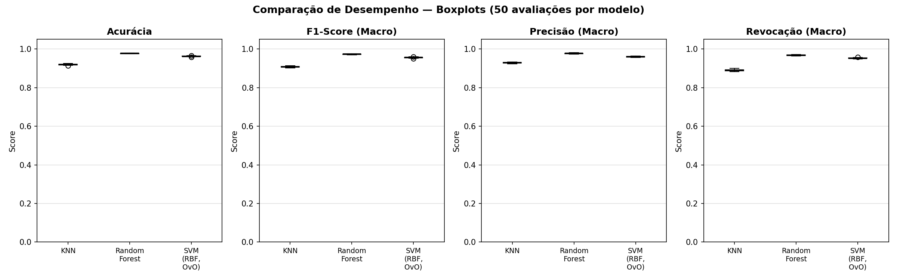
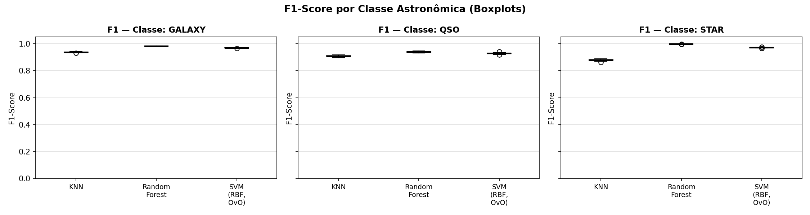
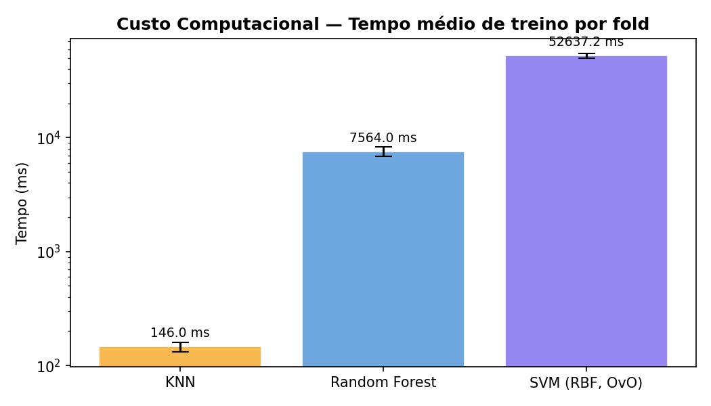

---

## 🚀 5. Conclusão e Recomendação

O modelo **Random Forest** é o campeão inconteste da experimentação, alcançando **F1-Macro de 0.9723** com tempo de treino de apenas 7.6s por fold e a menor variação (±0.0016). Oferece o melhor balanço entre acurácia, estabilidade e eficiência computacional.

O **SVM com kernel RBF (one-vs-one)**, embora teoricamente sofisticado, demonstra ser impraticável neste contexto: apesar de alcançar F1-Macro de 0.9560, requer **52.6s de treinamento por fold** — ~7 vezes mais que Random Forest. Isso ilustra uma lição crítica em ML: nem sempre o algoritmo mais sofisticado é o mais apropriado. Margem máxima e não-linearidade perduram para dataset de alta dimensionalidade e baixa densidade.

O pipeline valida que um **pré-processamento rigoroso** (remoção de features redundantes, tratamento de outliers, Z-score estratificado por fold), uma **seed determinística (42) em todos os componentes estocásticos** e **validação cruzada estratificada** são fundamentos mais críticos que sofisticação algorítmica para o sucesso de classificação astronômica em larga escala.

---

## 💻 6. Como Executar Localmente

Siga os passos abaixo para reproduzir os experimentos e análises gerados neste projeto:

1. **Clone o repositório:**
   ```bash
   git clone [https://github.com/Matheus-Emanue123/SDSS-Celestial-Classification.git](https://github.com/Matheus-Emanue123/SDSS-Celestial-Classification.git)
   cd NOME_DO_REPOSITORIO
   ```

2. **Crie um ambiente virtual (opcional, mas recomendado):**
   ```bash
   python -m venv venv
   
   # Para ativar no Windows:
   venv\Scripts\activate
   # Para ativar no Linux/Mac:
   source venv/bin/activate
   ```

3. **Instale as dependências:**
   ```bash
   pip install -r requirements.txt
   ```

4. **Execute o pipeline:**
   ```bash
   cd src/
   python main.py
   ```
   Os gráficos (PNG) e o relatório de métricas (CSV) serão salvos em `output/`.

### Alternativa: Usar Script Automatizado (Recomendado)

Todos os passos acima (venv, dependências, execução) podem ser realizados automaticamente:

**Para Windows:**
```bash
# Duplo-clique em run.bat
# OU via PowerShell/CMD:
.\run.bat
```

**Para Linux, Mac ou WSL:**
```bash
# Primeiro, torne o script executável:
chmod +x run.sh

# Depois execute:
bash run.sh
# OU:
./run.sh
```

O script fará automaticamente:
1. ✅ Verificar se Python 3 está instalado
2. ✅ Criar ambiente virtual (`venv`)
3. ✅ Instalar todas as dependências
4. ✅ Executar o pipeline completo
5. ✅ Salvar resultados em `output/`

---